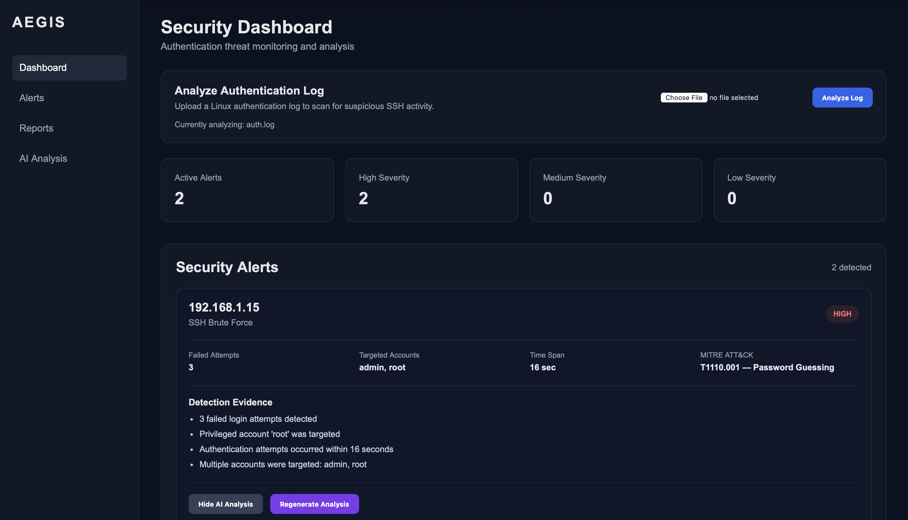
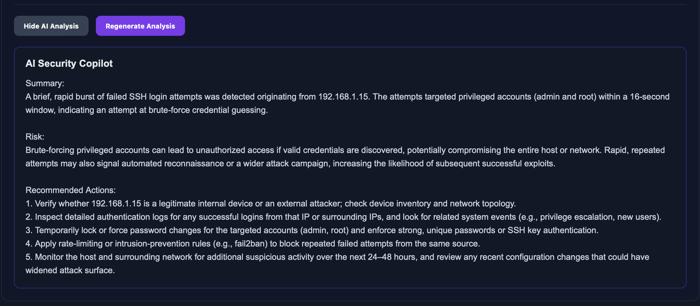

# Aegis

Aegis is an AI-assisted security investigation platform that analyzes Linux authentication logs, detects suspicious SSH activity, classifies attack patterns, maps findings to MITRE ATT&CK, and provides analyst-focused AI security assessments through a Flask dashboard.

## Screenshots

### Security Dashboard



### AI Security Copilot



## Overview

Security analysts often need to review large volumes of authentication logs to identify suspicious behavior and determine which alerts deserve investigation.

Aegis helps automate the first stage of that workflow by:

- Parsing Linux authentication logs
- Detecting repeated failed SSH login attempts
- Grouping suspicious activity by source IP
- Extracting targeted user accounts
- Measuring attack timing
- Assigning severity levels
- Classifying authentication attack patterns
- Generating explainable detection evidence
- Mapping detections to MITRE ATT&CK techniques
- Providing AI-assisted security analysis and recommended investigation steps

The detection engine operates independently from the AI layer. Rule-based logic identifies and classifies suspicious activity first, while the AI Security Copilot explains the findings and suggests investigation steps.

---

## Features

### Authentication Log Analysis

Aegis parses Linux SSH authentication logs and identifies repeated failed login activity.

### Attack Classification

Current classifications include:

- SSH Brute Force
- Username Enumeration
- Suspicious SSH Activity

### Severity Scoring

Alerts are assigned:

- HIGH
- MEDIUM
- LOW

Severity is determined using signals such as:

- Number of failed attempts
- Time between attempts
- Privileged account targeting
- Number of targeted accounts

### Detection Evidence

Aegis explains why an alert was generated instead of only displaying a severity score.

Example:

- 5 failed login attempts detected
- Privileged account `root` was targeted
- Authentication attempts occurred within 14 seconds
- Multiple accounts were targeted

### MITRE ATT&CK Mapping

Detected activity is mapped to relevant MITRE ATT&CK techniques.

Example:

`T1110.001 — Password Guessing`

### AI Security Copilot

Aegis integrates with the Groq API to generate an optional AI-assisted assessment for individual alerts.

The AI Copilot provides:

- Summary
- Risk explanation
- Recommended investigation or remediation actions

AI analysis is generated on demand rather than automatically for every alert.

### Log File Upload

Users can upload `.log` or `.txt` authentication logs directly through the dashboard.

### Security Dashboard

The Flask dashboard displays:

- Active alert count
- Severity distribution
- Source IP addresses
- Attack classifications
- Targeted accounts
- Attack time spans
- Detection evidence
- MITRE ATT&CK mappings
- AI Security Copilot analysis

---

## Architecture

```text
Authentication Log
        |
        v
    parser.py
        |
        v
   analyzer.py
        |
        +--------------------+
        |                    |
        v                    v
 severity.py       attack_classifier.py
        |                    |
        +---------+----------+
                  |
                  v
          mitre_mapping.py
                  |
                  v
             web_app.py
                  |
        +---------+----------+
        |                    |
        v                    v
 Flask Dashboard       ai_copilot.py
                             |
                             v
                         Groq API